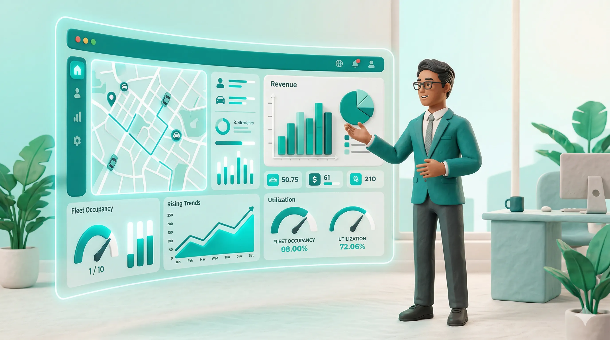
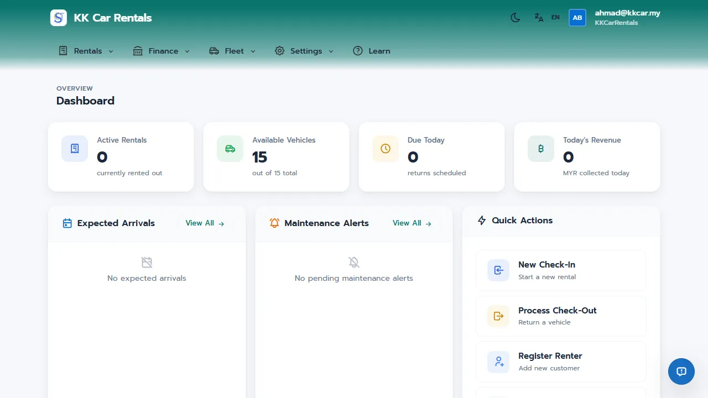
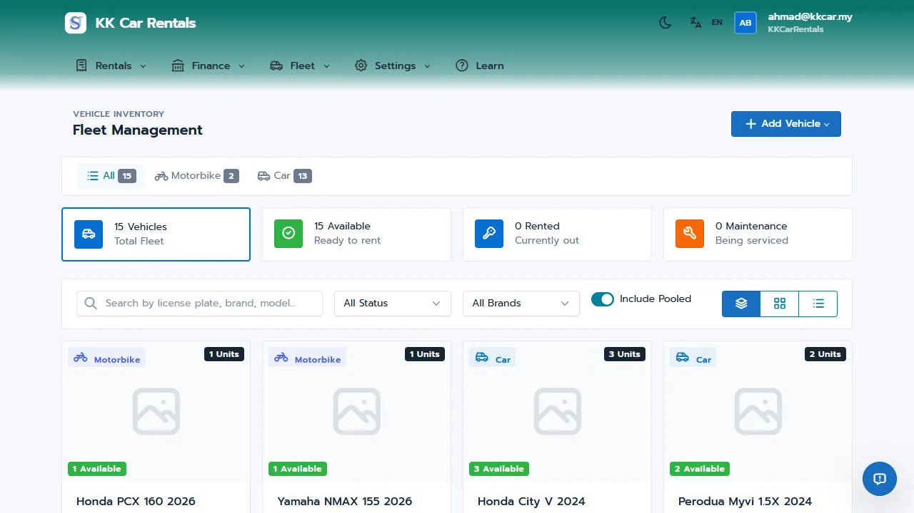
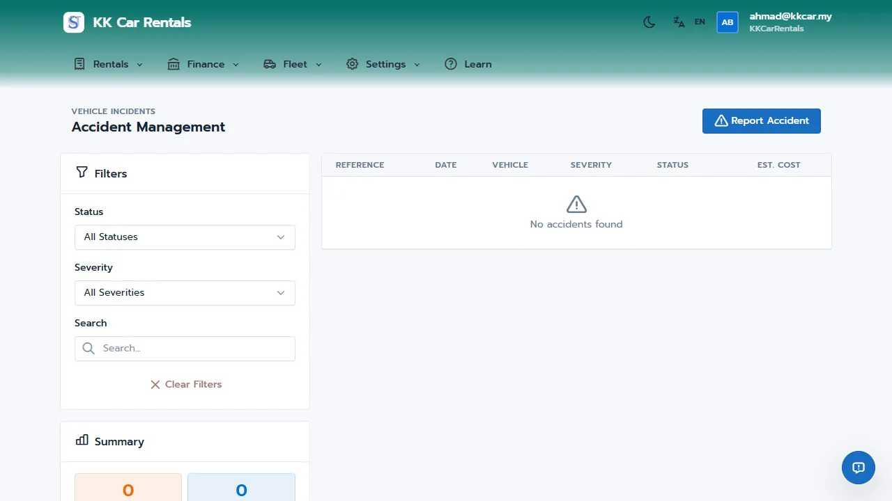

# JaleOS Quick Start Guide - Organization Admin

Welcome to JaleOS! This guide will help you get started as an Organization Admin (OrgAdmin).

## Your Role

As an OrgAdmin, you have **full access** to all features in JaleOS. You oversee the entire organization, including multiple shops, fleet, finances, and operational settings.

## 1. Dashboard Overview

The Management Dashboard provides a high-level view of your business performance:
- **KPI Metrics**: Real-time tracking of Today's Revenue, Active Rentals, Returns Due Today, and Fleet Utilization.
- **Revenue Trends**: Visual charts showing revenue growth over 7, 30, or 90 days.
- **Fleet Status**: A breakdown of your vehicles (Rented, Available, Maintenance).
- **Recent Activity**: A timeline of actions taken by staff and system events.

## 2. Fleet Management

Manage your assets efficiently under the **Fleet** menu:
- **All Vehicles**: View and manage your entire fleet across all shops. You can add new vehicles, update their status (e.g., move to maintenance), and track mileage.
- **Accessories**: Manage rental add-ons like helmets, phone holders, and child seats. Set daily rates and track available quantities.

## 3. Financial Oversight

Track the money flow under the **Finance** menu:
- **Payments**: A searchable list of all transactions (Rental, Insurance, Accessory, Damage, etc.).
- **Deposits**: Track security deposits held, refunded, or forfeited.
- **Owner Payments**: If you manage third-party owned vehicles, calculate and track payments due to owners based on daily rates or revenue share.
- **Reports**: Generate revenue summaries and operational reports to analyze performance.

## 4. Operational Settings

Configure your "Rules of the Game" under the **Settings** menu:
- **Insurance**: Group and manage insurance packages (Basic, Premium, Full Coverage).
- **Document Templates**: Use the visual designer to customize agreements and receipts.
- **Service Locations**: Manage pickup/drop-off points and one-way fees.
- **Shop Settings**: Update your shop's contact info, logo, and terms & conditions.
- **Operating Schedule**: Define your weekly opening hours.
- **Vehicle Pools**: Configure shared inventory between multiple shop locations.
- **Pricing Rules**: Adjust rental rates automatically based on seasons, events, and days of the week using the Pricing Calendar.

## 5. Partners & Incidents

- **Agents**: Register hotels and agencies, track referred bookings, and manage commissions.
- **Accidents**: Monitor accident reports including parties involved and repair costs.
- **Damage Reports**: Review damage documented during check-outs.

---
*Tip: Use the "Export Report" button on the dashboard to download data for offline analysis.*