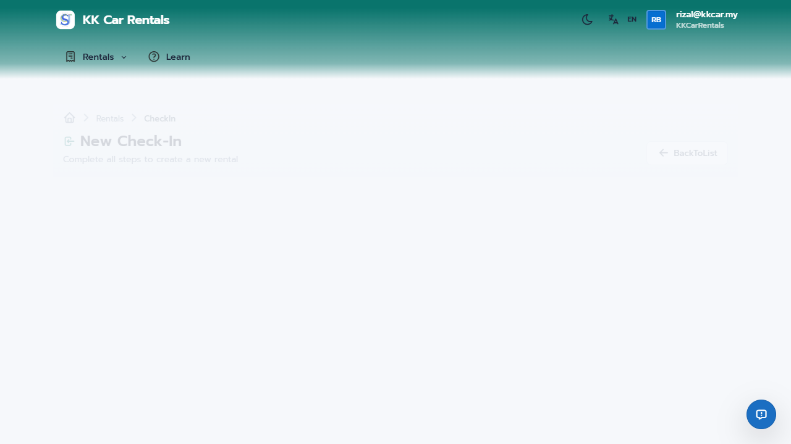
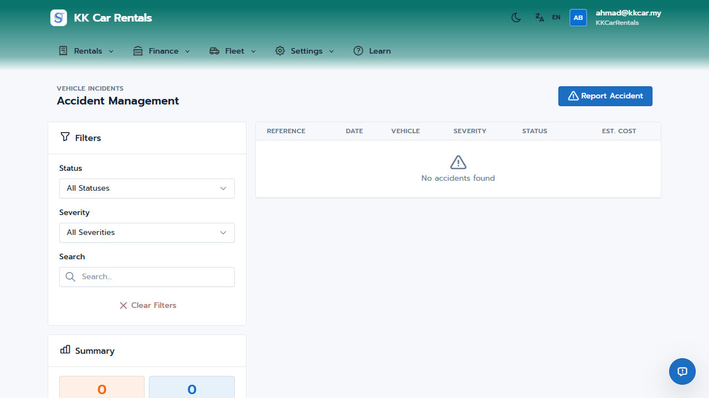

# JaleOS Quick Start Guide - Organization Admin

Welcome to JaleOS! This guide will help you get started as an Organization Admin (OrgAdmin).

## Your Role

As an OrgAdmin, you have **full access** to all features in JaleOS. You can manage:
- Rentals and check-ins/check-outs
- Fleet (vehicles and accessories)
- Finance (payments, deposits, reports)
- Accidents and incidents
- Customers (renters)
- Settings (shops, insurance, vehicle pools)

## Navigation Overview

Your navigation menu includes:

| Menu | Description |
|------|-------------|
| **Dashboard** | Overview of active rentals, available vehicles, and quick actions |
| **Rentals** | Manage active rentals, check-in new customers, check-out returns |
| **Agents** | Register and track third-party partners and commissions |
| **Finance** | Track payments, deposits, owner payments, and generate reports |
| **Fleet** | Manage all vehicle types (motorbikes, cars, boats, jet skis, vans) |
| **Accidents** | Report and track vehicle accidents and incidents |
| **Customers** | Manage renter records and history |
| **Settings** | Configure shops, insurance, templates, and pricing rules |

## Getting Started

### 1. Dashboard Overview

When you log in, you'll see your Dashboard with:
- **Active Rentals** - Number of vehicles currently rented
- **Available Vehicles** - Vehicles ready for rental
- **Due Today** - Returns expected today
- **Today's Revenue** - Total collected today

**Quick Actions** on the right let you:
- Start a New Check-In
- Process a Check-Out
- Register a new Renter
- Manage your Fleet

### 2. Processing a New Rental (Check-In)

1. Click **Rentals > Check-In** or the "New Check-In" button
2. Follow the 5-step wizard:
   - **Step 1: Renter** - Search for existing renter or create new (includes OCR for passport/ID)
   - **Step 2: Vehicle** - Select an available vehicle
   - **Step 3: Configure** - Set rental dates, insurance, accessories
   - **Step 4: Deposit** - Record deposit (cash or card)
   - **Step 5: Agreement** - Review and confirm rental agreement

### 3. Managing Your Fleet

Navigate to **Fleet > All Vehicles** to:
- View all vehicles across types (Motorbike, Car, Jet Ski, Boat, Van)
- Filter by status (Available, Rented, Maintenance)
- Add new vehicles with the "+ Add Vehicle" button
- Edit vehicle details, pricing, and status

**Vehicle Status Colors:**
- **Green (Available)** - Ready to rent
- **Blue (Rented)** - Currently out with a customer
- **Orange (Maintenance)** - Being serviced

### 4. Agent Management

Connect with hotels and travel agencies to grow your business:
- **Register Agents**: Track contact info and commission rates.
- **Link Bookings**: Automatically calculate commissions when agents refer customers.
- **Track Payouts**: Record and manage payments to agents via the Till.

See the [Agent Management Guide](10-agent-management-guide.md) for more details.

### 5. Finance Management

#### Payments
- Track all rental payments (Cash, Card, Touch 'n Go, FPX, Bank Transfer)
- Filter by status, method, and date range
- Record manual payments

#### Deposits
- View held deposits
- Process refunds when rentals complete
- Track forfeited deposits

#### Owner Payments
- If you manage vehicles for third-party owners, track their earnings and process monthly payouts.

### 6. Accident Management

When an accident occurs:
1. Go to **Accidents**
2. Click "Report Accident"
3. Fill in incident details across the new tabs:
   - **Details**: Date, time, location, and description.
   - **Parties**: Register other vehicles or persons involved.
   - **Costs**: Track repair estimates and actual expenses.
   - **Documents**: Upload police reports, insurance claims, and photos.
4. Track resolution progress and insurance payouts.

### 7. Customizing Your Documents

Use the **Document Template Designer** to make JaleOS look like your own brand:
- **Visual Editor**: Drag-and-drop blocks to design your own headers and footers.
- **Dynamic Data**: Use tokens like `{{CustomerName}}` to auto-fill rental info.
- **Standard Templates**: Create custom versions of Booking Confirmations, Rental Agreements, and Receipts.

See the [Document Template Designer Guide](09-template-designer-guide.md) for more details.

### 8. Shop & Service Locations

Configure your rental network under **Settings**:

#### Shop Settings
- Add new physical shop locations.
- Set operating hours and contact info.

#### Service Locations
- Manage pickup and drop-off points (Hotels, Airports).
- Set **Drop-off Fees** for one-way rentals.

See the [Service Locations Guide](11-service-locations-guide.md) for more details.

### 9. Dynamic Pricing & Calendar

Adjust rental rates automatically based on seasons, events, and days of the week.

Navigate to **Settings > Pricing Rules** to manage dynamic pricing:

#### Pricing Calendar
Use the visual **Pricing Calendar** to see exactly which rules are active for any given date and vehicle type.

#### Creating Pricing Rules
1. Click "+ Add Rule"
2. Configure the rule:
   - **Rule Name** - Descriptive name (e.g., "Peak Season", "Hari Raya")
   - **Rule Type** - Season, Event, Day of Week, or Custom
   - **Dates** - Start and end dates (or select day for weekly rules)
   - **Multiplier** - Price adjustment (e.g., 1.3 = +30%, 0.9 = -10%)
   - **Min/Max Rate** - Optional rate limits
   - **Priority** - Higher priority rules apply first when overlapping
   - **Vehicle Type** - Apply to specific types or all vehicles

#### Malaysia Preset
Click "Create Malaysia Preset" to instantly create common rules:
- **Peak Season** (Dec 1 - Feb 28): +30%
- **Hari Raya Aidilfitri** (varies yearly): +50%
- **School Holidays** (Jun - Jul): +20%
- **Weekend Premium** (Saturday): +10%

#### Rule Types
| Type | Description |
|------|-------------|
| **Season** | Recurring date ranges (e.g., High Season) |
| **Event** | One-time events or festivals |
| **Day of Week** | Weekly patterns (e.g., Weekend pricing) |
| **Custom** | Specific date ranges |

#### Price Preview
The dialog shows a live preview of how the multiplier affects pricing:
- Base rate: 500/day with 1.3x multiplier = 650/day (+30%)

## Tips for Success

1. **Daily Tasks:**
   - Check the Dashboard for due returns
   - Process check-outs promptly
   - Review overdue rentals

2. **Weekly Tasks:**
   - Review accident reports
   - Check vehicle maintenance status
   - Generate revenue reports

3. **Best Practices:**
   - Always take photos before and after rentals
   - Verify renter documents (passport/ID)
   - Keep insurance packages updated

## Getting Help

- Click **Documentation** in the footer for detailed guides
- Contact support through the Help link
- Check with your system administrator for account issues

---

*JaleOS - Vehicle Rental Management System*
