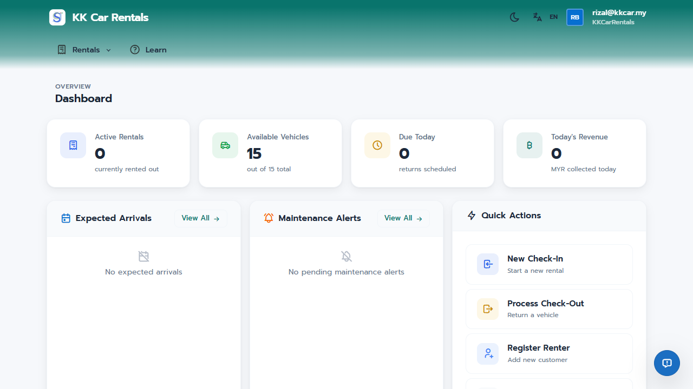
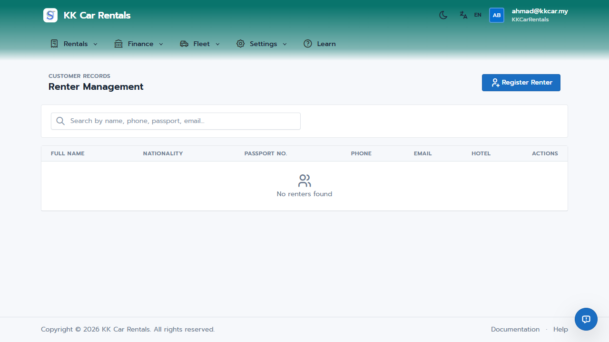

# JaleOS Quick Start Guide - Staff

This guide covers the daily operations for front-desk staff. Your primary goal is to provide a smooth check-in and check-out experience for renters.

## 1. Staff Dashboard

The Staff Dashboard is designed for quick actions:
- **New Check-In**: Start a new rental session.
- **Process Check-Out**: Process a returning vehicle.
- **Active Rentals**: View all currently rented vehicles.
- **Overdue**: Quickly see which rentals missed their return time.
- **Due Today**: A prioritized list of returns expected today.

## 2. Check-In Process (The Wizard)

When a customer arrives, use the **New Check-In** button. This follows a 5-step wizard:
1. **Rental Details**: Select the shop, duration type (Daily or Fixed Interval), and dates.
2. **Customer Registration**: Search for existing customers or register a new one. Use the **OCR Feature** (powered by Gemini AI) to automatically extract their name, ID number, and nationality from their ID or Passport.
3. **Vehicle & Options**: Select an available vehicle, insurance package, and accessories.
4. **Agreement & Signature**: Read the terms to the customer. They must sign directly on the screen.
5. **Payment & Review**: Record the rental payment and the security deposit (Cash or Card).

## 3. Processing Returns (Check-Out)

When a vehicle is returned:
1. Locate the rental in the **Due Today** list or via **Process Check-Out**.
2. **Standard Check**: Record the return mileage and end date.
3. **Damage Inspection**: Check the vehicle for new scratches or damages. If damage is found, create a **Damage Report** with photos and estimated costs.
4. **Deposit Refund**: The system calculates if any amount should be deducted from the deposit for damages or late returns. Process the refund to the customer.

## 4. Customer Management

Use the **Customers > Renters** menu to manage renter profiles. You can update contact information, verify documents, and view their rental history.

## 5. Reporting Accidents

If a customer reports an accident during their rental:
1. Go to **Accidents** and click **Report New Accident**.
2. Document the date, location, involved parties, and estimated costs in the respective tabs.
3. Upload any supporting documents or photos.

---
*Operational Tip: Always verify the original document (Passport/License) against the data extracted by the OCR feature for accuracy.*