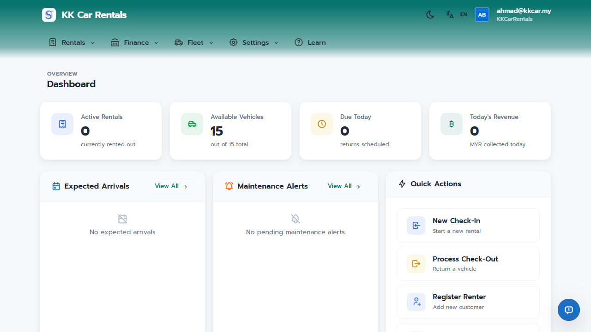
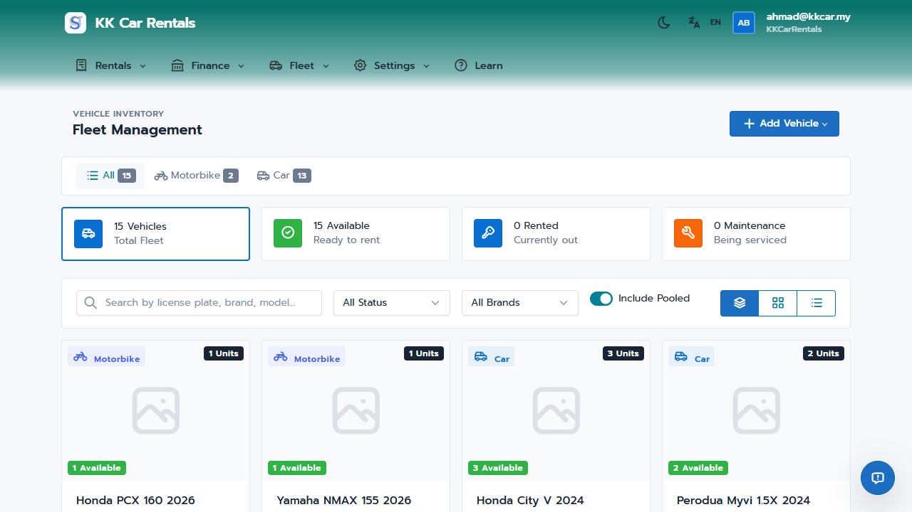
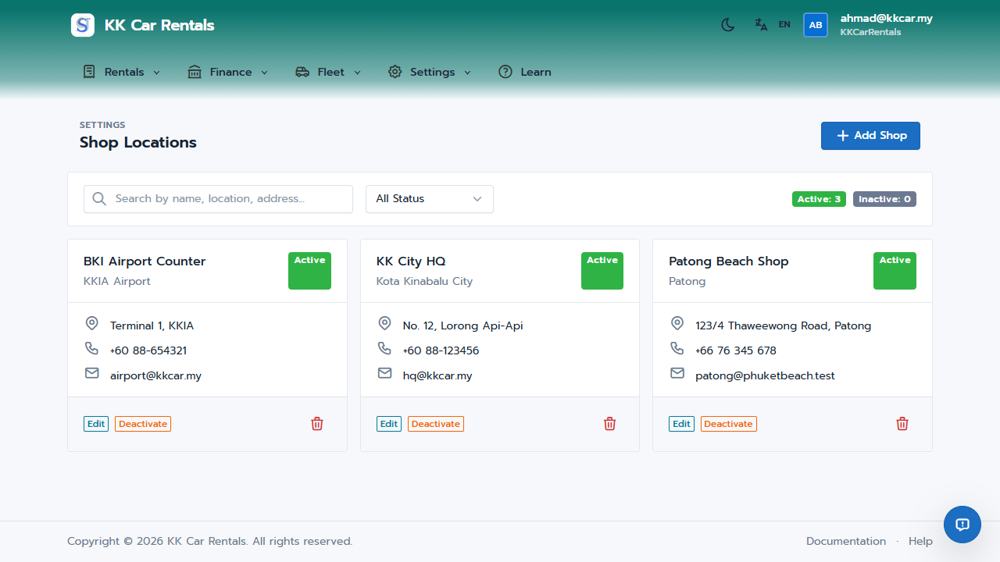

# JaleOS Quick Start Guide - Shop Manager

Welcome to the JaleOS Management Dashboard. As a Shop Manager, you have oversight of your shop's fleet, finances, and operational settings.

## 1. Dashboard Overview

The Management Dashboard provides a high-level view of your shop's performance:
- **KPI Metrics**: Real-time tracking of Today's Revenue, Active Rentals, Returns Due Today, and Fleet Utilization.
- **Revenue Trends**: Visual charts showing revenue growth.
- **Fleet Status**: A breakdown of your vehicles (Rented, Available, Maintenance).
- **Recent Activity**: A timeline of actions taken by staff and system events.

## 2. Fleet Management

Manage your assets efficiently under the **Fleet** menu:
- **All Vehicles**: View and manage your shop's fleet. You can add new vehicles, update their status, and track mileage.
- **Accessories**: Manage rental add-ons like helmets and phone holders. Set daily rates and track quantities.

## 3. Financial Oversight

Track the money flow under the **Finance** menu:
- **Payments**: A searchable list of all transactions.
- **Deposits**: Track security deposits held, refunded, or forfeited.
- **Owner Payments**: Calculate and track payments due to third-party owners.
- **Reports**: Generate revenue summaries and operational reports.

## 4. Shop Settings & Operations

Configure your shop under the **Settings** menu:
- **Shop Settings**: Update your shop's contact info, logo, and terms & conditions.
- **Operating Schedule**: Define your weekly opening hours.
- **Service Locations**: Manage pickup/drop-off points and one-way fees.
- **Vehicle Pools**: Configure shared inventory between multiple shop locations.
- **Pricing Rules**: Manage dynamic pricing for your shop based on seasons or days.

## 5. Partners & Incidents

- **Agents**: Register hotels and agencies, track referred bookings, and manage commissions.
- **Accidents**: Monitor accident reports including parties involved and repair costs.
- **Damage Reports**: Review damage documented during check-outs.

---
*Tip: Use the "Export Report" button on the dashboard to download data for offline analysis.*