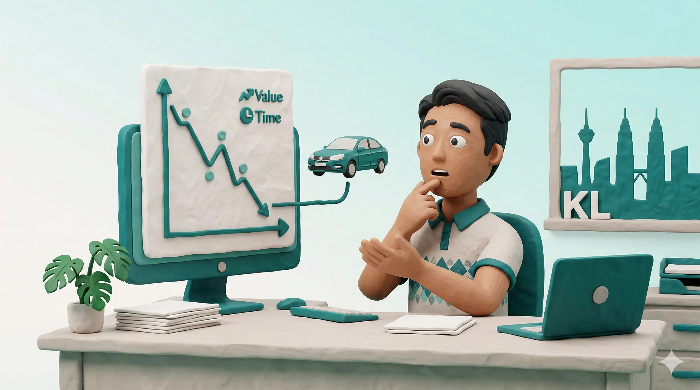
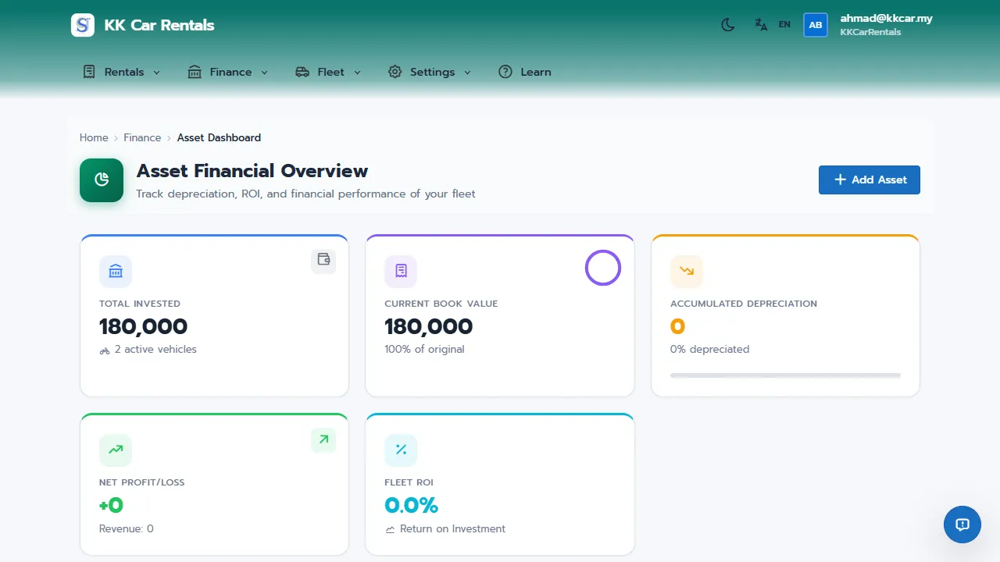
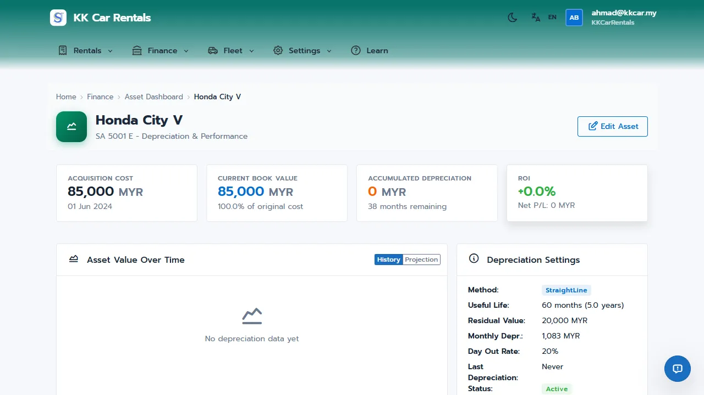

# Asset Depreciation Guide: The True Cost of Your Fleet

Many car rental owners in Malaysia look at their bank balance at the end of the month and mistake gross revenue for pure profit. But vehicles like the Perodua Bezza or Yamaha NMAX are depreciating assets. Every kilometer driven reduces their value.

If you don't track depreciation, you are living on borrowed time. When it's time to replace your aging fleet, you may realize you haven't saved enough capital because you unknowingly spent your "profit." 

**JaleOS Asset Depreciation** helps you track the declining value of your vehicles, showing you the *true* Return on Investment (ROI) and Net Profit. It ensures you know exactly when a vehicle is no longer profitable and needs to be sold.

## How It Works in 30 Seconds

1.  **Add Asset**: Link a financial record to a vehicle in your fleet with its acquisition cost.
2.  **Set Method**: Choose how the vehicle loses value (e.g., Straight Line over 5 years).
3.  **Run Depreciation**: JaleOS automatically calculates and records the value lost each month.
4.  **View Profitability**: The system subtracts depreciation and expenses from rental income to show your true Net Profit.

---

## Story: Khairul's Hidden Losses

Khairul owns a fleet of 20 cars in Penang. For two years, business felt great. Cash was flowing in.

*   **The Problem**: Khairul wasn't tracking depreciation. When five of his older cars started requiring expensive maintenance, he realized he needed to sell them. But he hadn't set aside any money from their previous rentals to cover the gap between their low resale value and the cost of new replacements.
*   **The Solution**: Khairul started using the **Asset Dashboard** in JaleOS. He set up "Straight Line" depreciation for his remaining fleet.
*   **The Result**: Khairul now sees exactly how much "equity" is left in each car. He knows his *actual* monthly profit after deducting the invisible cost of depreciation, allowing him to safely expand his fleet without cash-flow surprises.

---

## The Asset Dashboard: Your Financial Command Center

The Asset Dashboard (`/finance/asset-dashboard`) provides a comprehensive view of your fleet's financial health.

- **KPI Metrics**: Track Total Invested, Current Book Value, Accumulated Depreciation, and Fleet ROI.
- **Top Performers**: Instantly see which vehicles generate the highest true profit.
- **Attention Needed**: Get alerts for overdue depreciation runs or underperforming assets.

---

## Quick Setup: Tracking an Asset

### 1. Creating an Asset Record

To start tracking depreciation for a vehicle:

1. Navigate to **Finance > Assets** and click **+ Add Asset**.
2. Select the vehicle and enter the **Acquisition Date** and **Acquisition Cost** (e.g., RM 45,000).
3. Configure the settings:
   - **Method**: Choose how to calculate depreciation (see below).
   - **Useful Life**: Expected lifetime in months (e.g., 60 months).
   - **Residual Value**: Expected resale value at the end of its life (e.g., RM 15,000).
4. Click **Save**.

### 2. Depreciation Methods Explained

| Method | How It Works | Best For |
|--------|--------------|----------|
| **Straight Line** | Equal monthly amounts over the useful life. | Standard cars with predictable decline. |
| **Day Out of Door** | Immediate % depreciation on the first rental. | Motorbikes that lose significant value once used. |
| **Declining Balance** | % of current book value (high initially, slower later). | Luxury vehicles. |
| **Hybrid** | Day Out of Door + Straight Line. | Accurate tracking of initial drop + steady decline. |

### 3. Recording Depreciation

To keep your records accurate, you should run depreciation monthly:

1. Go to **Finance > Asset Dashboard** and click **Run Monthly Depreciation** in the Quick Actions menu.
2. Select the period (month/year) and review the calculated amounts.
3. Click **Confirm**.

---

## Deep Dive: Asset Details & Profitability

You can view detailed financial information for any single vehicle by clicking the chart icon in the asset list.

### Asset Value Chart
The Asset Details page (`/finance/assets/{id}/details`) features an interactive chart showing the vehicle's book value over time, including future projections based on your chosen depreciation method.

### Vehicle ROI Report
Navigate to **Finance > Reports > Profitability** to see:
- **Revenue**: Total rental income.
- **Expenses**: All costs (maintenance, insurance, financing).
- **Net Profit/Loss**: Revenue minus Expenses minus Depreciation.
- **ROI %**: The true return on your original investment.

Use this data to decide whether to keep repairing a vehicle or sell it before it becomes a liability.

---

## Related Guides
*   [01-orgadmin-quickstart.md](01-orgadmin-quickstart.md)
*   [14-asset-financing.md](14-asset-financing.md)
