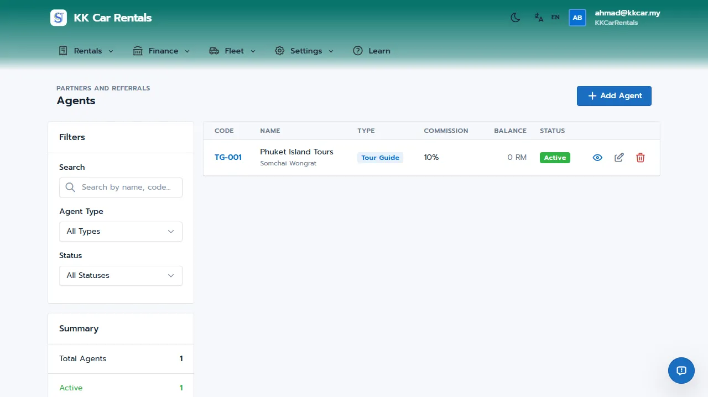
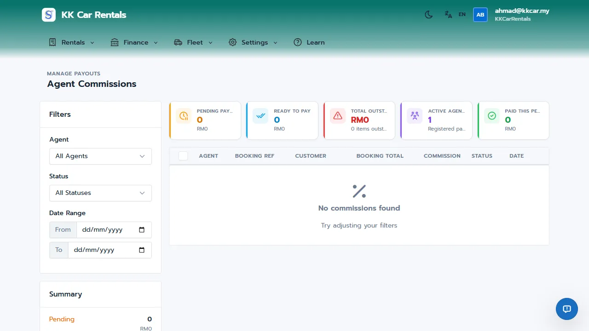

# Agent Management Guide: Partnering for Profit

In the Malaysian car rental market, walk-in customers are great, but consistent volume often comes from local partners: hotels, tour guides, and street agents. 

However, tracking who brought which customer and manually calculating commissions at the end of the month often leads to "lost" bookings, disputes, and delayed payments. 

**JaleOS Agent Management** formalizes these partnerships. It tracks every referred booking from start to finish and ensures your agents are paid accurately and on time through the Till system, building trust and encouraging them to send more business your way.

## How It Works in 30 Seconds

1.  **Register Partners**: Add hotels or individuals as "Agents" and set their default commission rate.
2.  **Link Bookings**: When checking in a referred customer, select the Agent from the dropdown.
3.  **Automatic Tracking**: JaleOS calculates the commission and holds it in a "Pending" state until the rental is completed.
4.  **Payout**: Once the rental is done, the commission becomes "Eligible" and can be paid out directly from the Cashier Till.

---

## Story: Ahmad and the Pantai Cenang Hotel Network

Ahmad runs a rental shop in Pantai Cenang. He works with 5 local hotels that recommend his cars to their guests.

*   **The Problem**: Previously, hotel receptionists would WhatsApp Ahmad to book cars. Ahmad tracked these in a notebook. At the end of the month, the hotels claimed they sent 20 customers, but Ahmad only had records for 15. Arguments over unpaid commissions damaged his relationships.
*   **The Solution**: Ahmad registered each hotel as an Agent in JaleOS with a flat RM50 commission per booking. Whenever a hotel guest rented a car, his staff selected the hotel in the Check-In Wizard.
*   **The Result**: The hotels could see they were being paid accurately and promptly. Trust increased, and within three months, Ahmad's referred bookings doubled because the receptionists preferred working with his transparent system.

---

## Quick Setup: Registering an Agent

1. Navigate to **Agents** in the sidebar.
2. Click **Add Agent**.
3. Enter the agent's details:
   - **Name**: Individual or business name (e.g., "Pelangi Beach Resort").
   - **Contact Info**: Phone and email.
   - **Commission Type**: Percentage (e.g., 10%) or Fixed amount (e.g., RM50) per booking.
   - **Default Rate**: The standard commission you pay this agent.
4. Click **Save**.

## Day-to-Day Operations: Tracking Commissions

When a customer arrives from an agent, simply select the **Agent** from the dropdown menu during the **Check-In** process. JaleOS handles the rest through a structured workflow:

### Commission Lifecycle
- **Pending**: The booking is active. The commission is calculated but not yet owed.
- **Eligible**: The rental is completed (checked out). The commission is now due to the agent.
- **Paid**: The commission has been recorded as paid.

### Processing Payments (Payouts)
To pay an agent, you use the daily Till:
1. Go to the **Till** page (ensure your session is open).
2. Click **Record Payout**.
3. Select **Agent Commission**.
4. Select the specific agent; the system will show all their "Eligible" commissions.
5. Enter the amount being paid out and confirm. 

The commission status will instantly update to **Paid**, and the payout will reflect in your daily Till reconciliation.

---

## Agent Performance Reports

Navigate to **Finance > Reports > Agent Performance** to see:
- Total bookings generated by each agent.
- Total revenue brought in.
- Total commissions paid vs. outstanding balances.

Use this data to identify your best partners and perhaps offer them higher commission tiers to encourage even more referrals!

---

## Related Guides
*   [01-orgadmin-quickstart.md](01-orgadmin-quickstart.md)
*   [04-shopmanager-quickstart.md](04-shopmanager-quickstart.md)
*   [08-cashier-till-guide.md](08-cashier-till-guide.md)
