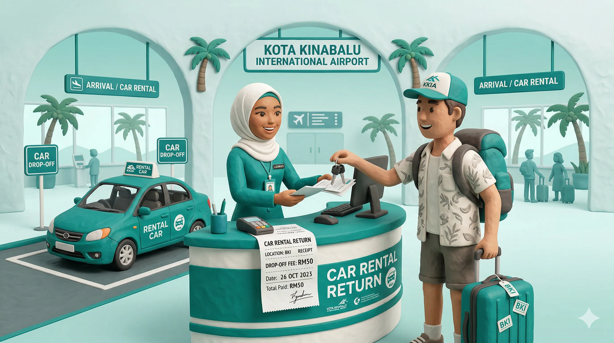
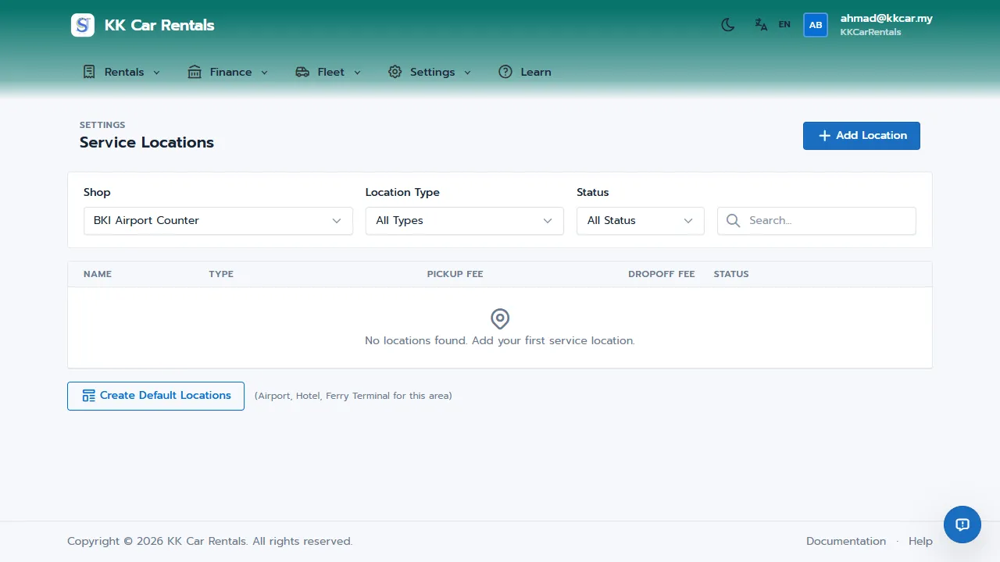
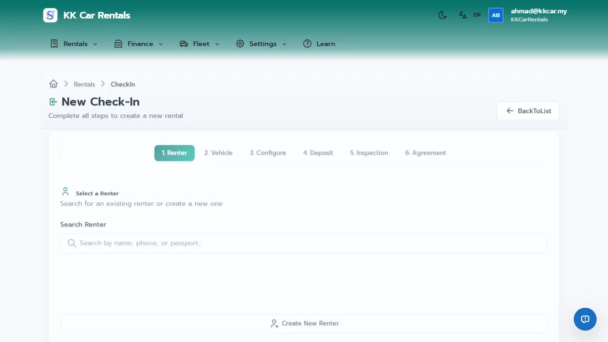

# Service Locations Guide: Mastering Drop-offs and Transfers

In tourist hubs like Sabah and Langkawi, flexibility is a massive competitive advantage. Tourists often want to pick up a car at the city office and drop it off at the airport (e.g., KKIA or LGK) before their flight. 

If you don't offer this, you lose the booking. But if you do offer it without a proper system, your staff wastes hours tracking where cars are parked, and you miss out on charging the appropriate **Drop-off Fees**.

**JaleOS Service Locations** turns this logistical challenge into a seamless revenue stream. It tracks the exact location of every vehicle in your fleet and automatically applies one-way fees when customers return vehicles to a different location.

## How It Works in 30 Seconds

1.  **Define Locations**: Add your shops, partner hotels, airports, or jetties to the system.
2.  **Set Drop-off Fees**: Configure how much extra to charge if a car is returned to a specific location (e.g., RM50 for Airport drop-offs).
3.  **Select at Check-in**: When renting a vehicle, select the expected Return Location; fees are added to the bill automatically.
4.  **Track Inventory**: The Fleet Dashboard always shows the current physical location of every car.

---

## Story: The Kota Kinabalu Airport Drop-off

Ahmad runs a rental fleet in Kota Kinabalu. A tourist family rented a Perodua Alza from his city office for a 5-day trip to Kundasang.

*   **The Scenario**: The family asked if they could return the car directly at Kota Kinabalu International Airport (BKI) at 6:00 AM on their final day to catch an early flight. 
*   **The Action**: During the Check-In Wizard, Ahmad's staff selected "KK City Office" as the Pickup Location and "BKI Airport" as the Return Location. 
*   **The Result**: JaleOS instantly added the pre-configured **RM50 Drop-off Fee** to the total bill. When the family left the car at the airport, Ahmad's driver went to collect it, and the system automatically updated the Alza's location back to the city office once it was retrieved. Ahmad secured the booking, provided excellent service, and made an extra RM50 to cover the collection cost.

---

## Quick Setup: Configuring Locations

1. Navigate to **Settings > Service Locations**.
2. Click **Add Location**.
3. Fill in the details:
   - **Name**: e.g., "Langkawi Airport", "Penang Main Office".
   - **Type**: Select Shop, Hotel, Airport, or Other.
   - **Drop-off Fee**: Set the additional charge (e.g., 50) if a customer returns a vehicle here instead of the pickup location.
4. Click **Save**.

## Day-to-Day Operations

### At Check-In
When processing a new rental through the Check-In Wizard, you can specify both the pickup and expected return points. 

If the Return Location is different from the Pickup Location, the **Drop-off Fee** will be automatically added to the rental total under "Additional Charges."

### Managing Breakdowns (Vehicle Swaps)
Service Locations aren't just for airports. Imagine a customer's car breaks down at a partner hotel in Batu Ferringhi:
1. You deliver a replacement car to the hotel.
2. You can update the broken car's location in JaleOS to "Hotel X".
3. The system tracks that the broken car is parked at the hotel until your mechanic retrieves it, ensuring you never lose track of a vehicle.

### Fleet Dashboard Tracking
The **Fleet Dashboard** shows the current `Location` tag for every vehicle, making it easy to see where your inventory is physically distributed across your network of shops, hotels, and airports.

---

## Related Guides
*   [01-orgadmin-quickstart.md](01-orgadmin-quickstart.md)
*   [04-shopmanager-quickstart.md](04-shopmanager-quickstart.md)