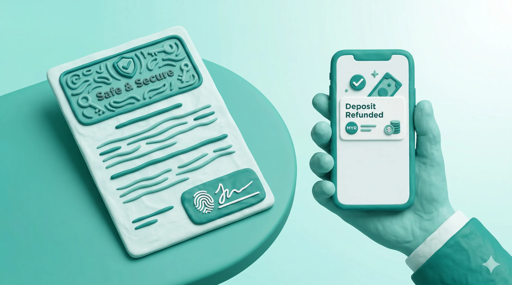

# Accident & Summons Recovery: Closing the Profit Leak

In the Malaysian car rental business, unrecovered **JPJ/PDRM summons (saman)** and **"Loss of Use"** gaps are the two biggest hidden killers of profit. 

Whether it's a speeding ticket on the North-South Highway or a fender-bender on the Pan-Borneo, JaleOs ensures that every Ringgit of damage or fine is documented, tracked, and recovered from the responsible party.

## How It Works in 30 Seconds

1.  **Incident Logging**: Record accidents or summons instantly with photo evidence.
2.  **Summons Matching**: Automatically link a summons date/time to the renter who had the car at that moment.
3.  **Revenue Recovery**: Generate "Loss of Use" (CART) invoices to recover the daily rental rate while a car is in the workshop.
4.  **Deposit Control**: Hold and manage summons deposits securely.

---

## Story: The "Pan-Borneo" Repair Gap

Azlan runs a fleet in Kuching, Sarawak. One of his Proton Sagas was hit while parked. Insurance paid for the repair, but the car was in the workshop for 12 days.

*   **The Problem**: Insurance only paid RM30/day for "Loss of Use" (CART). Azlan usually rents that car for RM130/day. He was losing RM1,200 in real income.
*   **The Solution**: Azlan used JaleOs to document the **"Revenue Gap."** The system generated a professional report showing the actual rental loss.
*   **The Result**: Because Azlan had a clear "Loss of Use" clause in his JaleOs-generated agreement, he was able to legally bill the renter's insurance (or the renter) for the difference, saving his monthly profit.

---

## The Numbers: Why Documenting Matters

Without a systematic way to track summons, you lose money every month.

| Item | Without JaleOs | With JaleOs |
| :--- | :--- | :--- |
| **PDRM Summons** | Owner pays RM300 | Renter pays (via deposit/transfer) |
| **Loss of Use** | You lose RM100/day | You recover the difference |
| **Damage Disputes** | "It was there before!" | Photo proof at Check-in |

---

## Quick Setup

### 1. Handling Summons (Saman)
1.  Go to **Finance > Traffic Fines**.
2.  Click **Add Summons** and enter the date, time, and Plate No.
3.  JaleOs will automatically suggest the **Renter** who was using the car at that time.
4.  **Action**: You can either charge the renter's deposit or use the OCR-captured IC/Passport to transfer the summons to them officially.

### 2. Reporting an Accident
1.  Go to **Accidents > New Report**.
2.  Select the **Vehicle** and **Rental Agreement**.
3.  **Upload Photos**: Capture the damage immediately.
4.  **Financials**: Enter the estimated repair cost and "Days Out of Service".

---

## Day-to-Day Operations

*   **Summons Deposit**: We recommend holding a **RM200-RM500 summons deposit** for 14 days after the car is returned.
*   **Photo Evidence**: Always use the **Damage Assessment** tool during both Check-in and Check-out.
*   **Blacklisting**: If a renter refuses to pay for a summons, use the **Blacklist** feature to prevent them from renting again (and warn other shops in your pool).

---

## Optimize Your Recovery

*   **Insurance Coordination**: Export the JaleOs Accident Report as a PDF to send directly to your insurance adjuster. It looks professional and speeds up claims.
*   **PromptPay Recovery**: Use the integrated **PromptPay QR** to let renters pay for small damages or summons instantly on the spot.

## Troubleshooting

| Problem | Solution |
| :--- | :--- |
| **No renter found for summons** | Check if your rental agreements were started/ended at the correct times in the system. |
| **Renter disputes damage** | Open the **Check-in Photos** for that specific rental to show the "Before" state. |

## Related Guides
*   [01-orgadmin-quickstart.md](01-orgadmin-quickstart.md)
*   [08-cashier-till-guide.md](08-cashier-till-guide.md)
