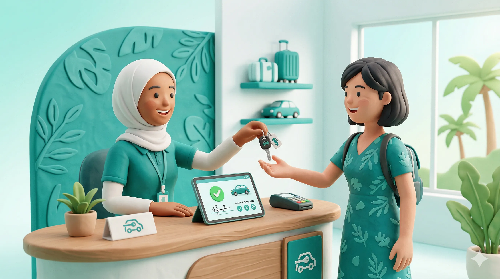
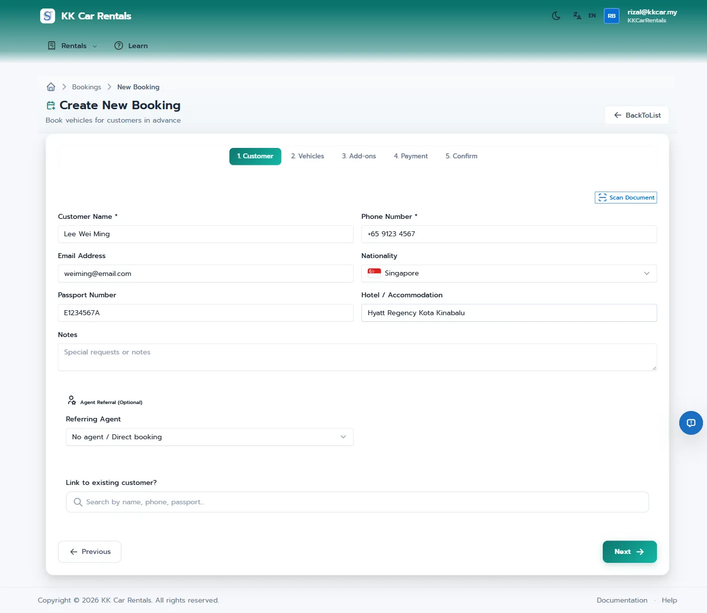
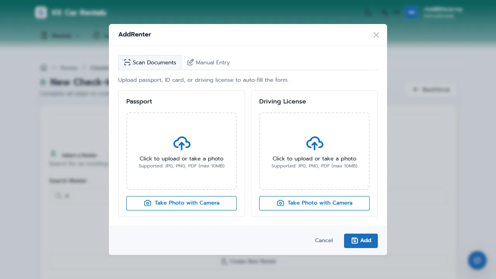
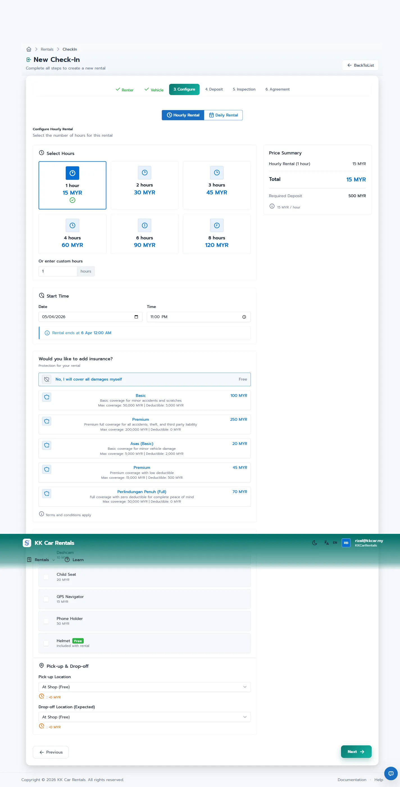
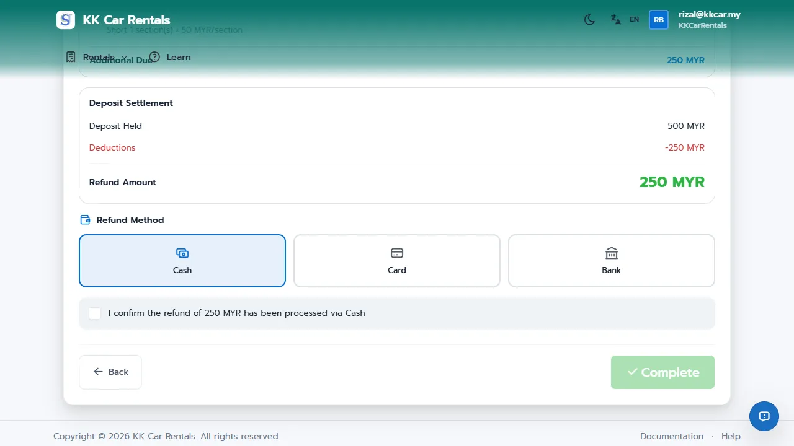

# Rental Operations Guide: A Seamless Experience

For many car rental businesses in Malaysia, the front desk is the biggest bottleneck. Manual data entry, paper agreements, and fuzzy "he said, she said" damage disputes lead to long queues, frustrated tourists, and lost money on repairs.

**JaleOS** digitizes the entire rental process. With features like eKYC (Optical Character Recognition), digital signatures, and strict photographic damage tracking, what used to be a 15-minute headache is now a 3-minute professional experience.

## How It Works in 30 Seconds

1.  **Online Booking**: Tourists browse your PWA, select dates/vehicles, add insurance, and pay a booking deposit directly.
2.  **Quick Check-In**: Use the camera to scan a passport or IC. The system automatically extracts the details.
3.  **Digital Agreements**: Customers sign the rental agreement directly on your tablet or smartphone.
4.  **Damage Tracking**: Staff take "Before" and "After" photos of the vehicle, eliminating disputes over scratches or dents.
5.  **Integrated Billing**: Automatically calculate late fees, extra days, or drop-off fees during Check-Out.

---

## 1. Online Booking & Reservations

Before a customer even arrives at your shop, JaleOS works for you. The built-in **Tourist Portal (PWA)** acts as your 24/7 online booking engine.

*   **Browsing**: Customers view real-time availability of your fleet (motorbikes, cars, vans).
*   **Booking Deposit**: Instead of just reserving a car and hoping they show up, you can require a **Booking Deposit** (e.g., RM50 or 20% of the total) paid securely via FPX, DuitNow QR, or Credit Card.
*   **Seamless Handover**: Because the customer has already filled in their details and paid a deposit online, your staff only needs to verify their identity and hand over the keys.

---

## 2. The Busy Friday Check-In (Story)

Rizal works the front desk at KK Car Rentals. It's Friday afternoon, and three families arrive at the same time to pick up their booked vehicles.

*   **The Problem**: In the past, Rizal had to manually type out everyone's passport details, photocopy their licenses, and print three copies of the paper contract for them to sign. Customers would wait 20 minutes just to get their keys.
*   **The Solution**: Rizal uses the JaleOS Check-In Wizard on his tablet. He snaps a photo of the first customer's passport, and the eKYC system instantly fills in the details. He selects the booked car, adds an up-sell for a child seat, and hands the tablet to the customer to sign digitally. 
*   **The Result**: The customer pays the remaining deposit, grabs the keys, and is out the door in under 3 minutes. The queue disappears, and Rizal's manager is happy with the seamless operation.

---

## 3. The Check-In Wizard

The Check-In process is a guided 5-step wizard designed to prevent staff from missing crucial steps.

### Step 1: Renter (eKYC)
Search for an existing renter or create a new one. When creating a new renter, use the **OCR Feature** (powered by Gemini AI). Simply take a photo of the Passport or MyKad, and the system extracts the Name, ID Number, and Nationality automatically.

### Step 2 & 3: Vehicle and Configuration
Select the available vehicle. In the Configuration step, you can:
- Adjust the rental dates and times.
- Select an **Insurance Package** (e.g., Basic, Full Coverage).
- Add **Accessories** (e.g., Helmets, Phone Holders) which automatically update the daily rate.

### Step 4 & 5: Deposit and Agreement
Collect the security deposit (Cash or Card Pre-auth) and record it in the Till. Finally, the customer reviews the generated rental agreement and signs it directly on the screen.

---

## 4. The Check-Out Process: Billing and Damage

When a vehicle is returned, the Check-Out process ensures everything is accounted for before the deposit is released.

### Damage and Cleanliness Tracking
The most critical step is the **Inspection**. Staff must review the vehicle's condition against the "Before" photos taken during Check-In. 
- If a new dent is found, staff create a **Damage Report** with a photo.
- The cost of the repair can be immediately deducted from the security deposit.
- Cleanliness and fuel level issues are also recorded here.

### Automatic Billing
The Check-Out dialog automatically calculates the final settlement:
- **Late Fees**: Added automatically if the vehicle is returned past the grace period.
- **Fuel Shortage**: Charge the customer if the fuel level is lower than when it left.
- **Drop-off Fees**: If the vehicle is returned to a different Service Location.

Once settled, the system processes the deposit refund and generates a final Settlement Receipt.

---

## Related Guides
*   [02-staff-quickstart.md](02-staff-quickstart.md)
*   [08-cashier-till-guide.md](08-cashier-till-guide.md)
*   [15-accidents-and-fines.md](15-accidents-and-fines.md)
