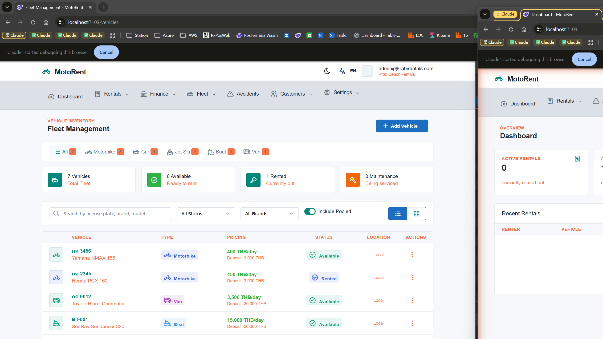

# Safe & Go Quick Start Guide - Shop Manager

Welcome to Safe & Go! This guide will help you get started as a Shop Manager.

## Your Role

As a Shop Manager, you have **full access** to manage your shop's operations:
- Oversee rentals and staff activities
- Manage fleet and inventory
- Track finance and payments
- Handle accidents and incidents
- Configure shop settings

## Navigation Overview

Your navigation menu includes:

| Menu | Description |
|------|-------------|
| **Dashboard** | Overview of shop performance |
| **Rentals** | Manage all rentals, check-ins, check-outs |
| **Finance** | Payments, deposits, owner payments, reports |
| **Fleet** | Vehicle and accessory management |
| **Accidents** | Incident tracking and resolution |
| **Customers** | Renter management |
| **Settings** | Shop configuration, insurance, vehicle pools |

## Getting Started

### 1. Dashboard - Your Command Center

Monitor your shop at a glance:
- **Active Rentals** - Vehicles currently out
- **Available Vehicles** - Ready for rental
- **Due Today** - Returns expected
- **Today's Revenue** - Daily collections

**Recent Rentals** table shows latest activity.

### 2. Managing Your Team

#### Staff Responsibilities
Staff can handle:
- Check-ins and check-outs
- Renter registration
- Accident reporting

#### What Staff Cannot Do
- Access Finance section
- Modify vehicle pricing
- Change shop settings

### 3. Fleet Management

Navigate to **Fleet > All Vehicles**

#### Vehicle Inventory
- View all vehicles by type
- Track availability status
- Monitor which vehicles are rented

#### Adding Vehicles
1. Click "+ Add Vehicle"
2. Fill in details:
   - License plate
   - Brand and model
   - Vehicle type
   - Daily rate and deposit
3. Set status to Available

#### Vehicle Status Management
- **Available** - Ready to rent
- **Rented** - Currently out (automatic)
- **Maintenance** - Take offline for service

### 4. Finance Overview

#### Payments
Track all rental payments:
- Filter by status, method, date
- View payment breakdown by type (Cash, Card, Transfer)
- Record manual payments

#### Deposits
Monitor security deposits:
- **Held** - Active rentals
- **Refunded** - Returned to customer
- **Forfeited** - Kept for damages

#### Owner Payments
If you manage vehicles for owners:
- Track owner earnings
- Process owner payouts

### 5. Accident Management

When staff report accidents:
1. Review the report details
2. Assess severity and costs
3. Update status as work progresses:
   - **Reported** - Initial report
   - **In Progress** - Being handled
   - **Resolved** - Completed
4. Document final costs

### 6. Shop Settings

#### Insurance Packages
Set up insurance options for customers:
1. Go to **Settings > Insurance**
2. Click "+ Add Package"
3. Configure:
   - Package name
   - Daily rate
   - Coverage amount
   - Deductible

#### Vehicle Pools
Share vehicles across shops:
1. Go to **Settings > Vehicle Pools**
2. Create pools for:
   - Multi-location sharing
   - Seasonal redistribution
   - Overflow management

#### Shop Configuration
Update your shop details:
- Contact information
- Address and location
- Operating hours
- Email settings

#### Pricing Rules
Manage dynamic pricing for your shop under **Settings > Pricing Rules**:

**What are Pricing Rules?**
Pricing rules automatically adjust rental rates based on:
- **Seasons** - High season surcharges (e.g., +30% Nov-Apr)
- **Events** - Festival pricing (e.g., +50% Songkran)
- **Days of Week** - Weekend premiums (e.g., +10% Saturday)

**Quick Start with Thailand Preset**
Click "Create Thailand Preset" to add common rules:
- High Season (Nov 15 - Apr 15): +30%
- Songkran Festival (Apr 13-15): +50%
- Weekend Premium (Saturday): +10%

**Creating Custom Rules**
1. Click "+ Add Rule"
2. Set rule type (Season, Event, Day of Week, Custom)
3. Configure date range or day
4. Set multiplier (e.g., 1.2 = +20%)
5. Optionally set min/max rates
6. Choose vehicle types to apply to

**Managing Rules**
- Toggle Active/Inactive status
- Edit rules as needed
- Delete rules that are no longer relevant
- Higher priority rules take precedence when overlapping

## Daily Management Tasks

### Morning Routine
- [ ] Check Dashboard for overnight activity
- [ ] Review due returns for the day
- [ ] Check for overdue rentals
- [ ] Brief staff on the day's bookings

### Throughout the Day
- [ ] Monitor active rentals
- [ ] Review completed check-outs
- [ ] Handle escalated issues
- [ ] Process accident reports

### End of Day
- [ ] Review daily revenue
- [ ] Check deposit status
- [ ] Address any pending issues
- [ ] Plan for tomorrow's returns

## Weekly Tasks

### Revenue Review
- Generate payment reports
- Analyze rental trends
- Compare to previous weeks

### Fleet Review
- Check vehicle utilization
- Review maintenance needs
- Plan vehicle rotation

### Team Check-in
- Review staff performance
- Address training needs
- Update procedures as needed

## Reports

Access reports through **Finance > Reports**:

| Report | Purpose |
|--------|---------|
| Revenue Report | Daily/weekly/monthly income |
| Rental Report | Rental activity summary |
| Fleet Report | Vehicle utilization |
| Deposit Report | Deposit status tracking |

## Best Practices

### Customer Service
1. Train staff on proper procedures
2. Ensure consistent pricing
3. Handle complaints promptly

### Fleet Management
1. Rotate vehicles regularly
2. Schedule preventive maintenance
3. Keep accessories stocked

### Financial Control
1. Reconcile payments daily
2. Monitor deposit handling
3. Review pricing competitively

### Risk Management
1. Ensure all rentals have proper documentation
2. Verify insurance coverage
3. Document vehicle conditions

## Troubleshooting

### Common Issues

**Vehicle shows wrong status**
- Check if rental was properly closed
- Verify in Rentals section

**Payment discrepancy**
- Review payment records
- Check deposit status

**Staff access issues**
- Verify role assignment
- Contact OrgAdmin if needed

## Getting Help

- **Technical Issues** - Contact your OrgAdmin
- **System Questions** - Check Documentation
- **Account Problems** - Contact support

---

*Safe & Go - Vehicle Rental Management System*
